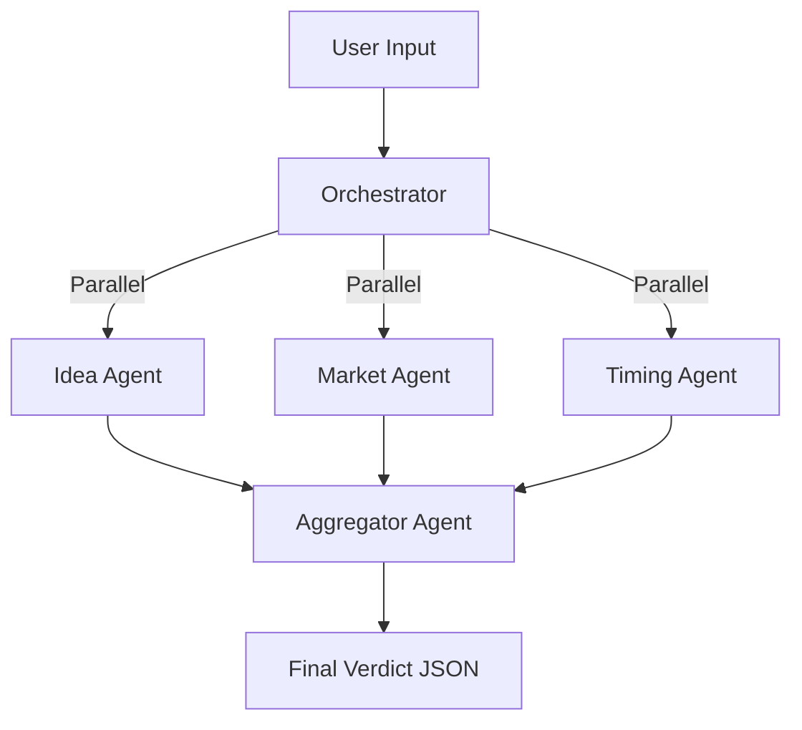

# AI System Architecture: "The Forge Engine"

> **Architecture Pattern:** Orchestrated Parallel Experts (Mixture of Experts)  
> **Framework:** Vercel AI SDK Core (`generateObject`)  
> **Runtime:** Next.js Server Actions (Node.js)

---

## 🏗 High-Level Flow

1.  **User Input** (Onboarding Form) is received by the Orchestrator.
2.  **Parallel Execution**: The Orchestrator spins up 3 specialized agents simultaneously.
3.  **Synthesis**: Once all 3 return validated JSON, the Aggregator Agent runs.
4.  **Delivery**: Final structured verdict is saved to DB and sent to Client.



---

## 🤖 The Agents (Experts)

Each agent acts as a specialized consultant. They do not know about each other. They only know their specific domain.

### 1. Idea Intelligence Agent (`idea-agent`)
**Role:** Product Strategist & CTO  
**Goal:** Clarify *what* is being built and *how*.  
**Inputs:** Idea text, Target User  
**Output Schema:**
```json
{
  "category": "SaaS | Marketplace | Consumer App | etc",
  "industry_vertical": "Fintech | Health | EdTech",
  "core_value_prop": "Clean one-sentence value proposition",
  "suggested_tech_stack": ["Next.js", "Supabase", "Stripe"],
  "monetization_models": ["Subscription", "Transaction Fee"]
}
```

### 2. Market Validation Agent (`market-agent`)
**Role:** Ruthless Market Researcher  
**Goal:** Validate if the *problem* is real and distinct.  
**Inputs:** Problem statement, Alternatives  
**Output Schema:**
```json
{
  "problem_severity": "Low (Nice to have) | High (Burning pain)",
  "market_saturation": "Blue Ocean | Competitive | Oversaturated",
  "existing_alternatives": [
    { "name": "Competitor A", "weakness": "Expensive/Slow" }
  ],
  "differentiation_potential": "Hard | Moderate | Easy"
}
```

### 3. Timing & Leverage Agent (`timing-agent`)
**Role:** Venture Capitalist Analyst  
**Goal:** Assess "Why Now?" and "Why You?".  
**Inputs:** Timing, Founder Fit, Stage  
**Output Schema:**
```json
{
  "macro_tailwinds": ["AI adoption", "Remote work"],
  "macro_headwinds": ["Regulatory scrutiny"],
  "founder_market_fit": "Strong | Neutral | Weak",
  "why_now_verdict": "Too Early | Perfect Timing | Too Late"
}
```

### 4. The Aggregator (`aggregator-agent`)
**Role:** Lead Partner / Investment Committee  
**Goal:** Synthesize all data into a structured evaluation model with quantified scores.  
**Inputs:** Outputs from A1, A2, and A3  
**Output Schema (Final):**
```json
{
  "overall_assessment": {
    "total_score": 78,
    "verdict": "REFINE",
    "confidence_level": 82,
    "summary": "This idea addresses a real problem but lacks clear differentiation."
  },
  "score_breakdown": {
    "problem_strength": { "score": 84, "weight": 0.25, "insight": "High severity." },
    "market_opportunity": { "score": 76, "weight": 0.20, "insight": "Growing market." },
    "differentiation_strength": { "score": 62, "weight": 0.20, "insight": "Weak moat." },
    "timing_readiness": { "score": 88, "weight": 0.15, "insight": "Perfect timing." },
    "founder_leverage": { "score": 70, "weight": 0.20, "insight": "Technical fit." }
  },
  "risk_profile": {
    "market_risk": { "level": "medium", "score": 58, "reason": "Crowded." },
    "execution_risk": { "level": "low", "score": 32, "reason": "Standard tech." },
    "timing_risk": { "level": "low", "score": 25, "reason": "Tailwinds." }
  },
  "competitive_landscape": {
    "saturation_level": "high",
    "differentiation_difficulty": "moderate",
    "positioning_gap": "Focus on niche X."
  },
  "strategic_analysis": {
    "primary_strengths": ["Clear problem"],
    "key_weaknesses": ["No distribution"]
  },
  "recommended_next_steps": ["Interview 10 users", "Build landing page"]
}
```

---

## 📂 File Structure

We will implement this structure in `lib/ai`:

```
lib/
└── ai/
    ├── orchestrator.ts       # Main entry point (calls all agents)
    ├── schemas.ts            # Zod definitions for all JSON outputs
    └── agents/
        ├── idea-agent.ts     # Wraps "System Instruction" + generateObject
        ├── market-agent.ts   # Wraps "System Instruction" + generateObject
        ├── timing-agent.ts   # Wraps "System Instruction" + generateObject
        └── aggregator.ts     # Wraps "System Instruction" + generateObject
```

## 📝 Implementation Notes for Developers

1.  **Strict Schemas**: We use `zod` for everything. If the AI output doesn't match the schema, Vercel AI SDK will automatically retry or fail gracefully.
2.  **No Hallucinations**: By asking for structured fields (e.g., "monetization_models" array), we force the model to think in categories, reducing conversational fluff.
3.  **Speed**: Agents 1, 2, and 3 must run in a `Promise.all()` block. Agent 4 awaits them.
